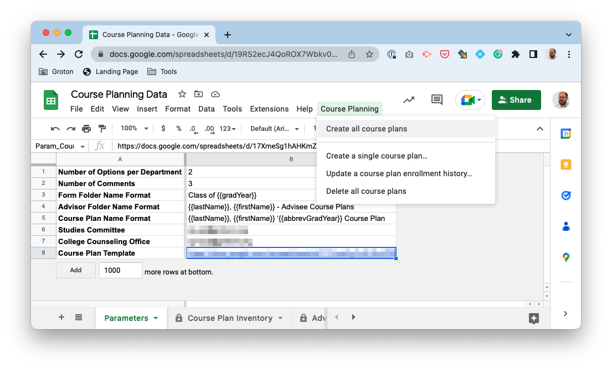

#  Course Planning Tool

## How to Use

### Workflows

All workflows are available from the `Course Planning` menu in the [Course Planning Data sheet](./schema/sheets/Course%20Planning%20Data.xlsx).

#### Create all course plans

Creates a new course plan for all students in the Advisor List sheet who do not already have a course plan registered in the Course Plan Inventory sheet, updating permissions and the Course Plan Inventory.

#### Create a single course plan…

Presents a dialog to choose a student from the list of students in the Advisor List sheet. Upon selection, it will create a new course plan for that student if there is not one already registered in the Course Plan Inventory sheet, updating permissions and the Course Plan Inventory. At the end, you will be presented with a direct link to the student course plan (either pre-existing or newly created).

#### Update a course plan enrollment history…

Updates a specific course plan to reflect updated enrollment history. This does not expand the enrollment history beyond the original scope (i.e., if created in the spring of 2023, and then updated in spring of 2024, it will _not_ add 2024 courses in and will _not_ overwrite plans/comments).

#### Delete all course plans

Clears the Form Folder Inventory, Advisor Folder Inventory, and Course Plan Inventory, deleting all referenced folders and course plans. A global reset.

### A student changes advisor (manual update)

1. Add the new advisor as an editor on the course plan
2. On the Course Plan sheet, adjust the Protected Ranges (under Data)
   1. Add the new advisor to Comments from Faculty Advisor
   2. Remove the old advisor from Comments from Faculty Advisor
3. Remove the old advisor as an editor on the spreadsheet
4. Move the shortcut to the course plan from the old advisory group folder to the new advisory group folder

## Technical Overview

- The course planning tool resides in the `Course Planning` shared drive.
- The data that drives it is stored in the [Course Planning Data sheet](./schema/sheets/Course%20Planning%20Data.xlsx).
- The code runs it is an Apps Script extension attached to the sheet, with [the source code managed on GitHub](https://github.com/groton-school/course-planning-tool).
- Any outstanding issues with the code are also [tracked on GitHub](https://github.com/groton-school/course-planning-tool/issues).
- Developing the code requires [node](https://nodejs.org/), [clasp](https://github.com/google/clasp#install), and [pnpm](https://pnpm.io/installation#using-npm) to install and manage dependencies and to compile and deploy the project.

### Permissions

- The project is owned by the `tech` account
- The groups `all-technology`, `cp-cco`, and `cp-sc` have general access to the files.
  - `cp-cco` represents the College Counseling Office
  - `cp-sc` represents the Studies Committee
- `cp-cco` and `cp-sc` have read/write access to the `Forms` and `Advisory Groups` folders
- Within each course plan, areas of the main Course Plan sheet are protected such that:
  - Only advisors, the college counseling office, and the studies committee can add comments in their respective comment sections
  - All labels and headings are not editable by any users
  - The Courses by Department sheet is not editable
- As they are created course plans are shared (without notification) with the student and advisor

### File Management

- All course plans are copies of the [Course Plan Template](./schema/sheets/Course%20Plan%20Template.xlsx) spreadsheet.
- The original course plans are stored by form in the `Forms` folder.
- The Courses by Department sheet of each course plan is imported dynamically (using `IMPORTRANGE()` from the [Course Planning Data](./schema/sheets/Course%20Planning%20Data.xlsx) sheet, so edits to that list should be made in [Course Planning Data](./schema/sheets/Course%20Planning%20Data.xlsx) and will simultaneously affect all Course Plans).
- Shortcuts to the course plans are stored by advisory group in the `Advisory Groups` folder, with each advisory group folder shared with the advisor (without notification).
- Links to each course plan, form folder, and advisory group folder are maintained in their respective inventory sheets in [Course Planning Data](./schema/sheets/Course%20Planning%20Data.xlsx)

### Data Sources

- Data in [Course Planning Data](./schema/sheets/Course%20Planning%20Data.xlsx) is pulled from [advanced list queries](./schema/queries) in Blackbaud
- Historical Enrollment, Advisor List, and Course List sheets each align with an advanced list in the Course Planning category, and can be synced using Seth’s experimental [Blackbaud Lists](https://github.com/groton-school/blackbaud-to-google-lists) Google Workspace Add-on. (Or manually with a lot of copying and pasting.)
- Other sheets in [Course Planning Data](./schema/sheets/Course%20Planning%20Data.xlsx) are generated from either these data sources or as a result of scripted workflows in the app.

## Setup

[Enable Drive Service](https://developers.google.com/apps-script/guides/services/advanced#enable_advanced_services)
