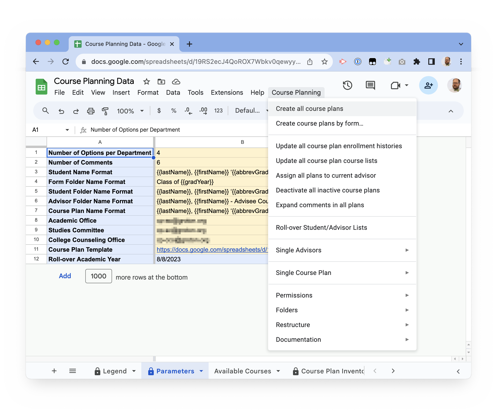

# Course Planning Tool

## How to Use

### Annual Updates

Queries or functions that need to be updated annually are listed here:

1. [Historical Enrollment](./schema/queries/historical-enrollment.md#filters) needs to be updated, as noted.
2. Advisor List, Course List, and Historical Enrollment sheets in Course Planning Data all need to be updated to current values (recommend using [Blackbaud Lists](https://github.com/groton-school/blackbaud-to-google-lists) add-on)
3. Available Courses needs to be reviewed for accuracy.
4. Review cp-cco, cp-ao, cp-sc group memberships for accuracy.


### Workflows

All workflows are available from the `Course Planning` menu in the [Course Planning Data sheet](./schema/sheets/Course%20Planning%20Data.xlsx).



#### Create all course plans

Creates a new course plan for all students in the Advisor List sheet who do not already have a course plan registered in the Course Plan Inventory sheet, updating permissions and the Course Plan Inventory.

#### Create course plans by form…

Presents a dialog to choose a form by class year. Upon selection, it will create a new course plan for each student in the form in the Advisor List sheet who do not already have a course plan registered in the Course Plan Inventory sheet, updating permissions and the Course Plan Inventory.

#### Update all course plan enrollment histories

Updates all course plans in the Course Plan Inventory to reflect updated enrollment history. See note on [Update a single course plan's enrollment history](#update-a-single-course-plans-enrollment-history) below.

#### Update all course plan course lists

Updates the Courses by Department sheet of all course plans in the Course Plan Inventory to match the Courses by Department sheet of the Course Planning Data sheet.

#### Create a single course plan…

Presents a dialog to choose a student from the list of students in the Advisor List sheet. Upon selection, it will create a new course plan for that student if there is not one already registered in the Course Plan Inventory sheet, updating permissions and the Course Plan Inventory. At the end, you will be presented with a direct link to the student course plan (either pre-existing or newly created).

#### Update a single course plan's enrollment history…

Updates a specific course plan to reflect updated enrollment history. This does not expand the enrollment history beyond the original scope (i.e., if created in the spring of 2023, and then updated in spring of 2024, it will _not_ add 2024 courses in and will _not_ overwrite plans/comments).

#### Update a single course plan's course list…

Updates a specific course plan's Courses by Department sheet to match the Course Planning Data Courses by Department sheet.

#### Delete all course plans

Clears the Plans Form Folder Inventory, Advisor Folder Inventory, and Course Plan Inventory, deleting all referenced folders and course plans. A global reset.

### A student changes advisor (manual update)

1. Add the new advisor as an editor on the course plan
2. On the Course Plan sheet, adjust the Protected Ranges (under Data)
   1. Add the new advisor to Comments from Faculty Advisor
   2. Remove the old advisor from Comments from Faculty Advisor
3. Remove the old advisor as an editor on the spreadsheet
4. Move the shortcut to the course plan from the old advisory group folder to the new advisory group folder

## Technical Overview

- The course planning tool resides in the `Course Planning` shared drive.
- The data that drives it is stored in the [Course Planning Data sheet](./schema/sheets/Course%20Planning%20Data.xlsx).
- The data in the sheet is pulled from Blackbaud advanced lists categorized as “Course Planning”.
- The code runs it is an Apps Script extension attached to the sheet, with [the source code managed on GitHub](https://github.com/groton-school/course-planning-tool).
- Any outstanding issues with the code are also [tracked on GitHub](https://github.com/groton-school/course-planning-tool/issues).
- Developing the code requires [node](https://nodejs.org/), [clasp](https://github.com/google/clasp#install), and [pnpm](https://pnpm.io/installation#using-npm) to install and manage dependencies and to compile and deploy the project.

### Permissions

- The project is owned by the `tech` account
- The groups `all-technology`, `cp-cco`, `cp-ao`, and `cp-sc` have general access to the files.
  - `cp-cco` represents the College Counseling Office
  - `cp-ao` represents the Academics Office
  - `cp-sc` represents the Studies Committee
- `cp-ao`, `cp-sc`, and `cp-cco` have read access to the entire shared drive.
- Only `tech` and `all-technology` have Content Manager access to the shared drive, which means that all other users have to ask permission before re-sharing files on the drive.
- `cp-ao` has limited edit access to the [Course Planning Data sheet](./schema/sheets/Course%20Planning%20Data.xlsx), specifically the checkboxes in the Available Courses worksheet to adjust what courses appear in the course plan drop-down menus.
- `cp-cco` has read/write access to the `Course Plans by Forms` folder
- `cp-cco` has read/write/delete access to the `Student Folders by Form` folder.
- Within each course plan, areas of the main Course Plan sheet are protected such that:
  - Only advisors and the college counseling office can add comments in their respective comment sections
  - All labels and headings are not editable by any users
  - The Courses by Department sheet is not editable
- As they are created course plans are shared (without notification) with the student and advisor
- The advanced lists that pull the data from Blackbaud are available to all Platform Managers

### File Management

- All course plans are copies of the [Course Plan Template](./schema/sheets/Course%20Plan%20Template.xlsx) spreadsheet.
- The original course plans are stored by form in the `Course Plans by Form` folder.
- Shortcuts to the course plans are stored in student folders by form in the `Student Folders by Form` folder
- Shortcuts to the student folders are stored by advisory group in the `Student Folders by Advisor`, with each advisory group folder shared with the advisor (without notification).
- Links to each course plan, student folder, course plans form folder, student folder form folder, and advisory group folder are maintained in their respective inventory sheets in [Course Planning Data](./schema/sheets/Course%20Planning%20Data.xlsx)

### Data Sources

- Data in [Course Planning Data](./schema/sheets/Course%20Planning%20Data.xlsx) is pulled from [advanced list queries](./schema/queries) in Blackbaud
- Historical Enrollment, Advisor List, and Course List sheets each align with an advanced list in the Course Planning category, and can be synced using Seth’s experimental [Blackbaud Lists](https://github.com/groton-school/blackbaud-to-google-lists) Google Workspace Add-on. (Or manually with a lot of copying and pasting.)
- Other sheets in [Course Planning Data](./schema/sheets/Course%20Planning%20Data.xlsx) are generated from either these data sources or as a result of scripted workflows in the app.

## Setup

To rebuild this project from scratch…

- Create Google Groups to represent CCO and SC (ideally not receiving email, etc. Nothing matters other than membership from the perspective of this script.)
- Create a shared drive to hold the project (CCO and SC have Viewer access)
- Create a spreadsheet (doesn’t have to be on the shared drive) from [Course Planning Data schema](./schema/sheets/Course%20Planning%20Data.xlsx) (includes named ranges, sheets, functions, etc.)
- Populate the Historical Enrollment, Advisor List, and Course Lists sheets of the Course Planning Data sheet from Blackbaud queries of the same name (easiest is to use [Blackbaud to Google Lists](https://github.com/groton-school/blackbaud-to-google-lists), which requires a little setup of its own – at Groton it’s already deployed to the workspace)
- Create a Spreadsheet from the [Course Plan Template schema](./schema/sheets/Course%20Plan%20Template.xlsx) (includes named ranges, again, doesn’t necessarily have to be on the shared drive)
- Update the Parameters sheet of the Course Planning data spreadsheet with…
  - CCO and SC group emails
  - URL of the Course Plan Template
- Create a folder on the shared drive to hold all course plan form folders, giving CCO Contributor access, and update the ID and URL columns of the Plan Form Folders Inventory sheet row for Form ROOT with that folder’s ID and URL.
- Create a folder on the shared drive to hold all advisory group folders, and update the ID and URL columns of the Advisor Folder Inventory sheet row for Advisor Email ROOT with that folder’s ID and URL.
- Create a folder on the shared drive to hold all student folder form folders, giving CCO Content Manager access, and update the ID and URL columns of the Folder Form Folders Inventory sheet row for Form ROOT with that folder's ID and URl/
- In the Course Planning Data spreadsheet, go to Extensions > Apps Script to open the embedded script for that sheet
  - Copy the ID of the script
  - [Enable Drive Service](https://developers.google.com/apps-script/guides/services/advanced#enable_advanced_services) for the script
- In your development workspace (answer yes when asked about over-writing your `appsscript.json` file)…

  ```bash
  git clone https://github.com/groton-school/course-planning-tool.git <project directory>
  cd <project directory>
  pnpm install
  npx clasp clone <script ID>
  git checkout appsscript.json
  npx run build
  npx run deploy
  ```

- Force-refresh the Course Planning Data spreadsheet to reload the newly-deployed script, and you’re all set.
