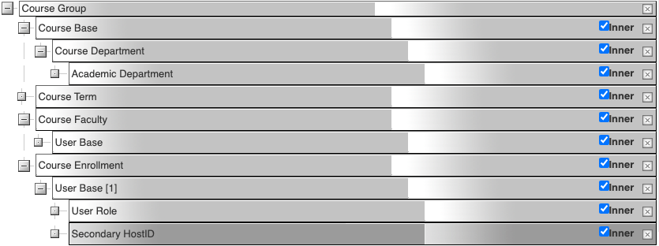
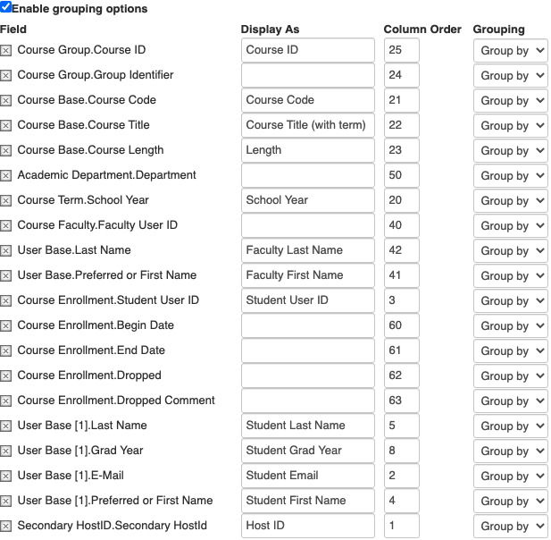
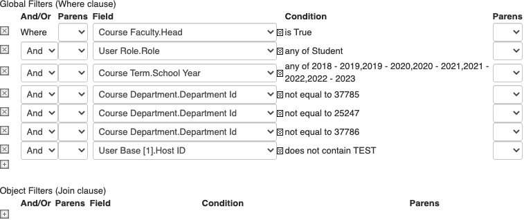
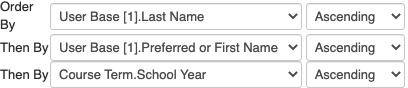

# Historical Enrollment

A list of Students with their classes (school year, term, course and teacher).

## Select Objects

## Display Fields

## Filters

The Department ID values where identified using the SKY API endpoint reference for Academic Departments, excluding several _non_-academic departments.

Note that the `Course Term.School Year` filter needs to be updated annually. It only needs to capture the current year and the three years previous, so that current 5th formers can plan for 6th form (6th formers do not need further planning).

## Order By

